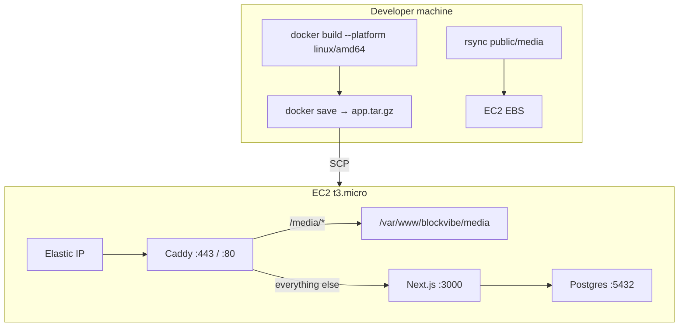

# Blockvibe Multitenant Deployment Guide

Self-hosted deployment on a single AWS EC2 instance: Next.js + Payload + Postgres + Caddy.

---

## Quick reference

| Phase | Command |
| --- | --- |
| **First-time infra** | `cd infra && terraform init && terraform apply` |
| **First-time env** | `cp .env.production.example .env.production` (edit secrets) |
| **Deploy (every time)** | `./infra/deploy.sh` |
| **Code-only deploy** | `./infra/deploy.sh --skip-media` |
| **Media-only sync** | `./infra/sync-media.sh` |
| **Push local DB → prod** | `./infra/push-db-to-prod.sh` |

See also: [infra/README.md](../../infra/README.md)

---

## 1. Architectural overview



### Why we build locally

`next build` is too heavy for a 1 GB RAM `t3.micro`. The deploy script compiles on your machine, ships a pre-built Docker image, and the server only loads and runs it.

---

## 2. Cost

| Resource | ~Cost |
| --- | --- |
| EC2 `t3.micro` | $7.50/mo (free tier eligible) |
| EBS 20 GB gp3 | $1.60/mo (free tier eligible) |
| Postgres in Docker | $0 |
| Media on EBS | $0 |
| TLS via Caddy + Let's Encrypt | $0 |

---

## 3. Prerequisites (local machine)

1. [Terraform](https://developer.hashicorp.com/terraform/downloads) (>= 1.0)
2. [Docker Desktop](https://www.docker.com/products/docker-desktop/)
3. `rsync` (pre-installed on macOS)
4. AWS credentials (`aws configure`)
5. Cloudflare API token + zone ID (optional, for DNS via Terraform)

---

## 4. First-time setup

### Step 1: Provision infrastructure

```bash
cd infra/
cp terraform.tfvars.example terraform.tfvars
# Edit terraform.tfvars with your domain, Cloudflare IDs, etc.
terraform init
terraform apply
```

This creates:

- EC2 instance with Docker, Caddy, and 4 GB swap (`userdata.sh`)
- Elastic IP
- SSH key at `infra/id_rsa`
- Cloudflare A records (if `cloudflare_zone_id` is set)

### Step 2: Create production environment file

```bash
cp .env.production.example .env.production
```

Fill in secrets (`PAYLOAD_SECRET`, `DB_PASSWORD`, etc.). `deploy.sh` uploads this as `/home/ubuntu/app/.env` on the server.

`NEXT_PUBLIC_SERVER_URL` must be your HTTPS domain (e.g. `https://info.blockvibe.org`).

### Step 3: Seed local content (optional)

If the production database is empty, seed locally first, then deploy (media syncs with the deploy):

```bash
pnpm dev
# Seed via admin UI or: npx tsx src/scripts/seed-nog.ts
```

To push your **local database** to production (local is source of truth):

```bash
./infra/push-db-to-prod.sh
```

This replaces the production Postgres data and syncs `public/media/`. `deploy.sh` does not migrate the database — use `push-db-to-prod.sh` when content changed locally.

### Step 4: Deploy

```bash
./infra/deploy.sh
```

---

## 5. What `deploy.sh` does

1. Reads EC2 IP from `terraform output`
2. **Builds** Docker image locally (`linux/amd64`)
3. **Saves** image as `app.tar.gz`
4. **Syncs** `public/media/` → `/var/www/blockvibe/media/` on EC2
5. **Uploads** `docker-compose.yml`, `.env.production`, `infra/Caddyfile`
6. **Loads** image on EC2 and runs `docker compose up -d`
7. **Reloads** Caddy (HTTPS + static media serving)

---

## 6. Media strategy

Payload stores **metadata in Postgres** and **files on disk** at `public/media/{tenant-slug}/`.

| Layer | Role |
| --- | --- |
| **Docker image** | App code only — media is not baked in |
| **EBS volume** | `/var/www/blockvibe/media` persists across redeploys |
| **Deploy script** | `rsync`s local `public/media/` on each deploy |
| **Caddy** | Serves `/media/*` directly from disk |
| **Admin uploads** | On production go to EBS; survive restarts |

Pull production uploads back to local:

```bash
rsync -avz -e "ssh -i infra/id_rsa" \
  ubuntu@$(cd infra && terraform output -raw instance_public_ip):/var/www/blockvibe/media/ \
  ./public/media/
```

### When to move to S3

Stay on EBS + rsync while media is small (tens of MB). Move to **S3 + `@payloadcms/storage-s3` + CloudFront** when you need CDN, multi-server, or >5 GB storage.

---

## 7. HTTPS (Caddy)

HTTPS is configured automatically via `infra/Caddyfile` (uploaded on every deploy). Caddy obtains Let's Encrypt certificates for the domains listed in that file.

To add a new tenant subdomain, add it to `infra/Caddyfile` and redeploy.

### On-demand TLS (advanced)

For arbitrary custom domains without listing each one in the Caddyfile, see the on-demand TLS section in `userdata.sh` comments and implement `/api/caddy-check` in the app.

---

## 8. Troubleshooting

SSH in:

```bash
ssh -i infra/id_rsa ubuntu@$(cd infra && terraform output -raw instance_public_ip)
```

| Task | Command |
| --- | --- |
| App logs | `cd app && sudo docker compose logs -f payload` |
| DB logs | `sudo docker compose -f app/docker-compose.yml logs -f db` |
| Caddy status | `sudo systemctl status caddy` |
| Caddy logs | `sudo journalctl -u caddy --no-pager -n 50` |
| Check media on disk | `ls /var/www/blockvibe/media/` |
| Memory / swap | `free -h` |

---

## 9. Future CI/CD

For GitHub Actions, build and push to `ghcr.io` on CI, then SSH to EC2 and `docker pull` + `docker compose up -d` instead of SCP-ing tarballs. See Payload deployment docs for patterns.
